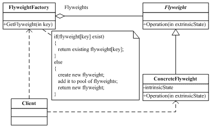

### 享元

#### 一、定义

介绍完享元模式的精髓之后，让我们具体看看享元模式的正式定义：

享元模式——运用共享技术有效地支持大量细粒度的对象。享元模式可以避免大量相似类的开销，在软件开发中如果需要生成大量细粒度的类实例来表示数据，如果这些实例除了几个参数外基本上都是相同的，这时候就可以使用享元模式来大幅度减少需要实例化类的数量。如果能把这些参数（指的这些类实例不同的参数）移动类实例外面，在方法调用时将他们传递进来，这样就可以通过共享大幅度地减少单个实例的数目。（这个也是享元模式的实现要领）,然而我们把类实例外面的参数称为享元对象的外部状态，把在享元对象内部定义称为内部状态。具体享元对象的内部状态与外部状态的定义为：

内部状态：在享元对象的内部并且不会随着环境的改变而改变的共享部分

外部状态：随环境改变而改变的，不可以共享的状态。


#### 二、代码

分析完享元模式的实现思路之后，相信大家实现享元模式肯定没什么问题了，下面以一个实际的应用来实现下享元模式。这个例子是：一个文本编辑器中会出现很多字面，使用享元模式去实现这个文本编辑器的话，会把每个字面做成一个享元对象。享元对象的内部状态就是这个字面，而字母在文本中的位置和字体风格等其他信息就是它的外部状态。下面就以这个例子来实现下享元模式，具体实现代码如下：


```c#
/// <summary>
    /// 客户端调用
    /// </summary>
    class Client
    {
        static void Main(string[] args)
        {
            // 定义外部状态，例如字母的位置等信息
            int externalstate = 10;
            // 初始化享元工厂
            FlyweightFactory factory = new FlyweightFactory();

            // 判断是否已经创建了字母A，如果已经创建就直接使用创建的对象A
            Flyweight fa = factory.GetFlyweight("A");
            if (fa != null)
            {
                // 把外部状态作为享元对象的方法调用参数
                fa.Operation(--externalstate);
            }
            // 判断是否已经创建了字母B
            Flyweight fb = factory.GetFlyweight("B");
            if (fb != null)
            {
                fb.Operation(--externalstate);
            }
            // 判断是否已经创建了字母C
            Flyweight fc = factory.GetFlyweight("C");
            if (fc != null)
            {
                fc.Operation(--externalstate);
            }
            // 判断是否已经创建了字母D
            Flyweight fd= factory.GetFlyweight("D");
            if (fd != null)
            {
                fd.Operation(--externalstate);
            }
            else
            {
                Console.WriteLine("驻留池中不存在字符串D");
                // 这时候就需要创建一个对象并放入驻留池中
                ConcreteFlyweight d = new ConcreteFlyweight("D");
                factory.flyweights.Add("D", d);
            }

            Console.Read();
        }
    }

    /// <summary>
    /// 享元工厂，负责创建和管理享元对象
    /// </summary>
    public class FlyweightFactory
    {
        // 最好使用泛型Dictionary<string,Flyweighy>
        //public Dictionary<string, Flyweight> flyweights = new Dictionary<string, Flyweight>();
        public Hashtable flyweights = new Hashtable();

        public FlyweightFactory()
        {
            flyweights.Add("A", new ConcreteFlyweight("A"));
            flyweights.Add("B", new ConcreteFlyweight("B"));
            flyweights.Add("C", new ConcreteFlyweight("C"));
        }

        public Flyweight GetFlyweight(string key)
        {
// 更好的实现如下
            //Flyweight flyweight = flyweights[key] as Flyweight;
            //if (flyweight == null)
            //{
            //    Console.WriteLine("驻留池中不存在字符串" + key);
            //    flyweight = new ConcreteFlyweight(key);
            //}
            //return flyweight;
return flyweights[key] as Flyweight;
        }
    }

    /// <summary>
    ///  抽象享元类，提供具体享元类具有的方法
    /// </summary>
    public abstract class Flyweight
    {
        public abstract void Operation(int extrinsicstate);
    }

    // 具体的享元对象，这样我们不把每个字母设计成一个单独的类了，而是作为把共享的字母作为享元对象的内部状态
    public class ConcreteFlyweight : Flyweight
    {
        // 内部状态
        private string intrinsicstate ;

        // 构造函数
        public ConcreteFlyweight(string innerState)
        {
            this.intrinsicstate = innerState;
        }

        /// <summary>
        /// 享元类的实例方法
        /// </summary>
        /// <param name="extrinsicstate">外部状态</param>
        public override void Operation(int extrinsicstate)
        {
            Console.WriteLine("具体实现类: intrinsicstate {0}, extrinsicstate {1}", intrinsicstate, extrinsicstate);
        }
    }
```


#### 三、类图



在上图中，涉及的角色如下几种角色：

抽象享元角色（Flyweight）:此角色是所有的具体享元类的基类，为这些类规定出需要实现的公共接口。那些需要外部状态的操作可以通过调用方法以参数形式传入。

具体享元角色（ConcreteFlyweight）：实现抽象享元角色所规定的接口。如果有内部状态的话，可以在类内部定义。

享元工厂角色（FlyweightFactory）：本角色复杂创建和管理享元角色。本角色必须保证享元对象可以被系统适当地共享，当一个客户端对象调用一个享元对象的时候，享元工厂角色检查系统中是否已经有一个符合要求的享元对象，如果已经存在，享元工厂角色就提供已存在的享元对象，如果系统中没有一个符合的享元对象的话，享元工厂角色就应当创建一个合适的享元对象。

客户端角色（Client）：本角色需要存储所有享元对象的外部状态。

注：上面的实现只是单纯的享元模式，同时还有复合的享元模式，由于复合享元模式较复杂，这里就不给出实现了。

#### 四、享元模式的优缺点

分析完享元模式的实现之后，让我们继续分析下享元模式的优缺点：

**优点：**

1. 降低了系统中对象的数量，从而降低了系统中细粒度对象给内存带来的压力。

**缺点：**

1. 为了使对象可以共享，需要将一些状态外部化，这使得程序的逻辑更复杂，使系统复杂化。
2. 享元模式将享元对象的状态外部化，而读取外部状态使得运行时间稍微变长。

####  五、使用场景

在下面所有条件都满足时，可以考虑使用享元模式：

- 一个系统中有大量的对象；
- 这些对象耗费大量的内存；
- 这些对象中的状态大部分都可以被外部化
- 这些对象可以按照内部状态分成很多的组，当把外部对象从对象中剔除时，每一个组都可以仅用一个对象代替
- 软件系统不依赖这些对象的身份，

满足上面的条件的系统可以使用享元模式。但是使用享元模式需要额外维护一个记录子系统已有的所有享元的表，而这也需要耗费资源，所以，应当在有足够多的享元实例可共享时才值得使用享元模式。