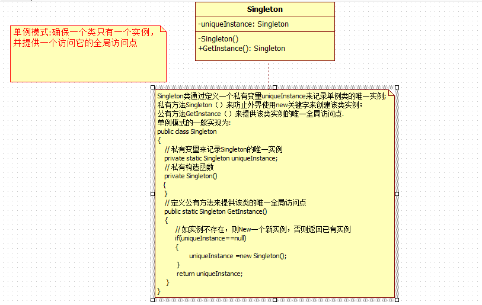

### 单例模式

#### 一、使用场景与要点

确保类只会提供一个实例，内的构造为私有的，并且类内部会提供一个 公开的方法或者属性来获取类的实例

#### 二、UML图




#### 三、普通单例的代码实现

```c#
/// <summary>
    /// 单例模式的实现
    /// </summary>
    public class Singleton
    {
        // 定义一个静态变量来保存类的实例
        private static Singleton uniqueInstance;

        // 定义私有构造函数，使外界不能创建该类实例
        private Singleton()
        {
        }

        /// <summary>
        /// 定义公有方法提供一个全局访问点,同时你也可以定义公有属性来提供全局访问点
        /// </summary>
        /// <returns></returns>
        public static Singleton GetInstance()
        {
            // 如果类的实例不存在则创建，否则直接返回
            if (uniqueInstance == null)
            {
                uniqueInstance = new Singleton();
            }
            return uniqueInstance;
        }
    }
```


#### 四、双锁单例的实现

主要应对多线程下访问

```c#
/// <summary>
    /// 单例模式的实现
    /// </summary>
    public class Singleton
    {
        // 定义一个静态变量来保存类的实例
        private static Singleton uniqueInstance;

        // 定义一个标识确保线程同步
        private static readonly object locker = new object();

        // 定义私有构造函数，使外界不能创建该类实例
        private Singleton()
        {
        }

        /// <summary>
        /// 定义公有方法提供一个全局访问点,同时你也可以定义公有属性来提供全局访问点
        /// </summary>
        /// <returns></returns>
        public static Singleton GetInstance()
        {
            // 当第一个线程运行到这里时，此时会对locker对象 "加锁"，
            // 当第二个线程运行该方法时，首先检测到locker对象为"加锁"状态，该线程就会挂起等待第一个线程解锁
            // lock语句运行完之后（即线程运行完之后）会对该对象"解锁"
            lock (locker)
            {
                // 如果类的实例不存在则创建，否则直接返回
                if (uniqueInstance == null)
                {
                    uniqueInstance = new Singleton();
                }
            }

            return uniqueInstance;
        }
    }
```

