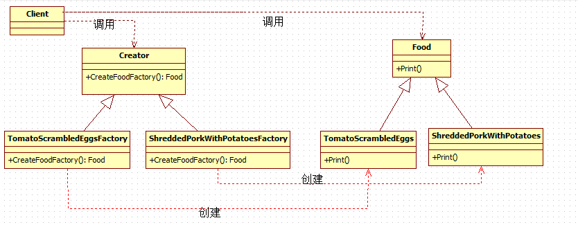

### 工厂方法


#### 一、直接上代码

```c#
namespace 设计模式之工厂方法模式
{
    /// <summary>
    /// 菜抽象类
    /// </summary>
    public abstract class Food
    {
        // 输出点了什么菜
        public abstract void Print();
    }

    /// <summary>
    /// 西红柿炒鸡蛋这道菜
    /// </summary>
    public class TomatoScrambledEggs : Food
    {
        public override void Print()
        {
            Console.WriteLine("西红柿炒蛋好了！");
        }
    }

    /// <summary>
    /// 土豆肉丝这道菜
    /// </summary>
    public class ShreddedPorkWithPotatoes : Food
    {
        public override void Print()
        {
            Console.WriteLine("土豆肉丝好了");
        }
    }

    /// <summary>
    /// 抽象工厂类
    /// </summary>
    public abstract class Creator
    {
        // 工厂方法
        public abstract Food CreateFoddFactory();
    }

    /// <summary>
    /// 西红柿炒蛋工厂类
    /// </summary>
    public class TomatoScrambledEggsFactory:Creator
    {
        /// <summary>
        /// 负责创建西红柿炒蛋这道菜
        /// </summary>
        /// <returns></returns>
        public override Food CreateFoddFactory()
        {
            return new TomatoScrambledEggs();
        }
    }

    /// <summary>
    /// 土豆肉丝工厂类
    /// </summary>
    public class ShreddedPorkWithPotatoesFactory:Creator
    {
        /// <summary>
        /// 负责创建土豆肉丝这道菜
        /// </summary>
        /// <returns></returns>
        public override Food CreateFoddFactory()
        {
            return new ShreddedPorkWithPotatoes();
        }
    }

    /// <summary>
    /// 客户端调用
    /// </summary>
    class Client
    {
        static void Main(string[] args)
        {
            // 初始化做菜的两个工厂（）
            Creator shreddedPorkWithPotatoesFactory = new ShreddedPorkWithPotatoesFactory();
            Creator tomatoScrambledEggsFactory = new TomatoScrambledEggsFactory();

            // 开始做西红柿炒蛋
            Food tomatoScrambleEggs = tomatoScrambledEggsFactory.CreateFoddFactory();
            tomatoScrambleEggs.Print();

            //开始做土豆肉丝
            Food shreddedPorkWithPotatoes = shreddedPorkWithPotatoesFactory.CreateFoddFactory();
            shreddedPorkWithPotatoes.Print();

            Console.Read();
        }
    }  
}
```

如果需要新增某个内容，直接创建对应的“工厂”和类就行了

```c#
/// <summary>
    /// 肉末茄子这道菜
    /// </summary>
    public class MincedMeatEggplant : Food
    {
        /// <summary>
        /// 重写抽象类中的方法
        /// </summary>
        public override void Print()
        {
            Console.WriteLine("肉末茄子好了");
        }
    }
 /// <summary>
    /// 肉末茄子工厂类，负责创建肉末茄子这道菜
    /// </summary>
    public class MincedMeatEggplantFactory : Creator
    {
        /// <summary>
        /// 负责创建肉末茄子这道菜
        /// </summary>
        /// <returns></returns>
        public override Food CreateFoddFactory()
        {
            return new MincedMeatEggplant();
        }
    }

    /// <summary>
    /// 客户端调用
    /// </summary>
    class Client
    {
        static void Main(string[] args)
        {
           
            // 如果客户又想点肉末茄子了
            // 再另外初始化一个肉末茄子工厂
            Creator minceMeatEggplantFactor = new MincedMeatEggplantFactory();

            // 利用肉末茄子工厂来创建肉末茄子这道菜
            Food minceMeatEggplant = minceMeatEggplantFactor.CreateFoddFactory();
            minceMeatEggplant.Print();

            Console.Read();
        }
    }
```


#### 二、UML图



从UML图可以看出，**在工厂方法模式中，工厂类与具体产品类具有平行的等级结构，它们之间是一一对应的**。针对UML图的解释如下：

**Creator**类：充当抽象工厂角色，任何具体工厂都必须继承该抽象类

**TomatoScrambledEggsFactory**和**ShreddedPorkWithPotatoesFactory**类：充当具体工厂角色，用来创建具体产品

**Food**类：充当抽象产品角色，具体产品的抽象类。任何具体产品都应该继承该类

**TomatoScrambledEggs**和**ShreddedPorkWithPotatoes**类：充当具体产品角色，实现抽象产品类对定义的抽象方法，由具体工厂类创建，它们之间有一一对应的关系。