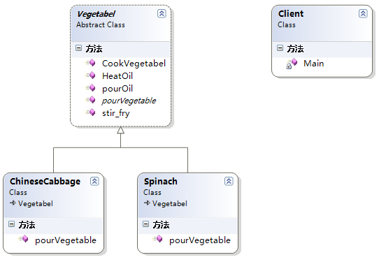

### 模板方法模式

 #### 一、代码

理解了模板方法的定义之后，自然实现模板方法也不是什么难事了，下面以生活中炒蔬菜为例来实现下模板方法模式。在现实生活中，做蔬菜的步骤都大致相同，如果我们针对每种蔬菜类定义一个烧的方法，这样在每个类中都有很多相同的代码，为了解决这个问题，我们一般的思路肯定是把相同的部分抽象出来到抽象类中去定义，具体子类来实现具体的不同部分，这个思路也正式模板方法的实现精髓所在，具体实现代码如下：

```c#
// 客户端调用
    class Client
    {
        static void Main(string[] args)
        {
            // 创建一个菠菜实例并调用模板方法
            Spinach spinach = new Spinach();
            spinach.CookVegetabel();
            Console.Read();
        }
    }

    public abstract class Vegetabel
    {
        // 模板方法，不要把模版方法定义为Virtual或abstract方法，避免被子类重写，防止更改流程的执行顺序
        public  void CookVegetabel()
        {
            Console.WriteLine("抄蔬菜的一般做法");
            this.pourOil();
            this.HeatOil();
            this.pourVegetable();
            this.stir_fry();
        }

        // 第一步倒油
        public  void pourOil()
        {
            Console.WriteLine("倒油");
        }

        // 把油烧热
        public  void HeatOil()
        {
            Console.WriteLine("把油烧热");
        }

        // 油热了之后倒蔬菜下去，具体哪种蔬菜由子类决定
        public abstract void pourVegetable();

        // 开发翻炒蔬菜
        public  void stir_fry()
        {
            Console.WriteLine("翻炒");
        }
    }

    // 菠菜
    public class Spinach : Vegetabel
    {
       
        public override void pourVegetable()
        {
            Console.WriteLine("倒菠菜进锅中");
        }
    }

    // 大白菜
    public class ChineseCabbage : Vegetabel
    {      
        public override void pourVegetable()
        {
            Console.WriteLine("倒大白菜进锅中");
        }
    }
```

#### 二、UML



#### 三、优缺点

下面让我们继续分析下模板方法的优缺点。

**优点：**

1. 实现了代码复用
2. 能够灵活应对子步骤的变化，符合开放-封闭原则

**缺点**：因为引入了一个抽象类，如果具体实现过多的话，需要用户或开发人员需要花更多的时间去理清类之间的关系。