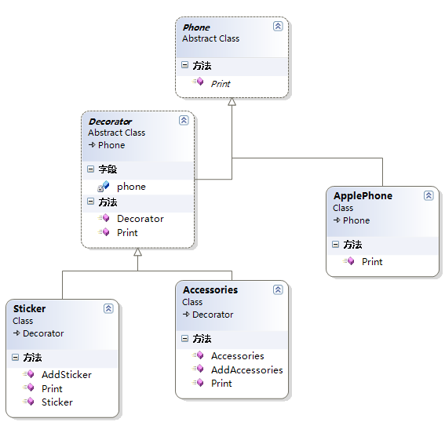
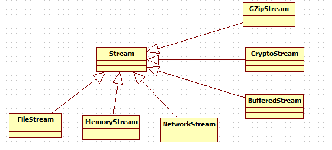

### 装饰者

#### 一、代码

```c#
/// <summary>
    /// 手机抽象类，即装饰者模式中的抽象组件类
    /// </summary>
    public abstract class Phone
    {
        public abstract void Print();
    }

    /// <summary>
    /// 苹果手机，即装饰着模式中的具体组件类
    /// </summary>
    public class ApplePhone:Phone
    {
        /// <summary>
        /// 重写基类方法
        /// </summary>
        public override void Print()
        {
            Console.WriteLine("开始执行具体的对象——苹果手机");
        }
    }

    /// <summary>
    /// 装饰抽象类,要让装饰完全取代抽象组件，所以必须继承自Photo
    /// </summary>
    public abstract class Decorator:Phone
    {
        private Phone phone;

        public Decorator(Phone p)
        {
            this.phone = p;
        }

        public override void Print()
        {
            if (phone != null)
            {
                phone.Print();
            }
        }
    }

    /// <summary>
    /// 贴膜，即具体装饰者
    /// </summary>
    public class Sticker : Decorator
    {
        public Sticker(Phone p)
            : base(p)
        { 
        }

        public override void Print()
        {
            base.Print();

            // 添加新的行为
            AddSticker();      
        }

        /// <summary>
        /// 新的行为方法
        /// </summary>
        public void AddSticker()
        {
            Console.WriteLine("现在苹果手机有贴膜了");
        }
    }

    /// <summary>
    /// 手机挂件
    /// </summary>
    public class Accessories : Decorator
    {
        public Accessories(Phone p)
            : base(p)
        {
        }

        public override void Print()
        {
            base.Print();

            // 添加新的行为
            AddAccessories();          
        }

        /// <summary>
        /// 新的行为方法
        /// </summary>
        public void AddAccessories()
        {
            Console.WriteLine("现在苹果手机有漂亮的挂件了");
        }
    }
```

此时客户端调用代码如下：

```c#
class Customer
    {
        static void Main(string[] args)
        {
            // 我买了个苹果手机
            Phone phone = new ApplePhone();

            // 现在想贴膜了
            Decorator applePhoneWithSticker = new Sticker(phone);
            // 扩展贴膜行为
            applePhoneWithSticker.Print();
            Console.WriteLine("----------------------\n");

            // 现在我想有挂件了
            Decorator applePhoneWithAccessories = new Accessories(phone);
            // 扩展手机挂件行为
            applePhoneWithAccessories.Print();
            Console.WriteLine("----------------------\n");

            // 现在我同时有贴膜和手机挂件了
            Sticker sticker = new Sticker(phone);
            Accessories applePhoneWithAccessoriesAndSticker = new Accessories(sticker);
            applePhoneWithAccessoriesAndSticker.Print();
            Console.ReadLine();
        }
```

从上面的客户端代码可以看出，客户端可以动态地将手机配件增加到手机上，如果需要添加手机外壳时，此时只需要添加一个继承Decorator的手机外壳类，从而，装饰者模式扩展性也非常好。

#### 二、UML图



在装饰者模式中各个角色有：

- 抽象构件（Phone）角色：给出一个抽象接口，以规范准备接受附加责任的对象。
- 具体构件（AppPhone）角色：定义一个将要接收附加责任的类。
- 装饰（Dicorator）角色：持有一个构件（Component）对象的实例，并定义一个与抽象构件接口一致的接口。
- 具体装饰（Sticker和Accessories）角色：负责给构件对象 ”贴上“附加的责任。


#### 三、优缺点

### 优点：

1. 装饰这模式和继承的目的都是扩展对象的功能，但装饰者模式比继承更灵活
2. 通过使用不同的具体装饰类以及这些类的排列组合，设计师可以创造出很多不同行为的组合
3. 装饰者模式有很好地可扩展性

**缺点**：装饰者模式会导致设计中出现许多小对象，如果过度使用，会让程序变的更复杂。并且更多的对象会是的差错变得困难，特别是这些对象看上去都很像。


#### 四、.net中装饰者模式 的实现



上图中，BufferedStream、CryptoStream和GZipStream其实就是两个具体装饰类，这里的装饰者模式省略了抽象装饰角色（Decorator）。下面演示下客户端如何动态地为MemoryStream动态增加功能的。

```c#
MemoryStream memoryStream = new MemoryStream(new byte[] {95,96,97,98,99});

            // 扩展缓冲的功能
            BufferedStream buffStream = new BufferedStream(memoryStream);

            // 添加加密的功能
            CryptoStream cryptoStream = new CryptoStream(memoryStream,new AesManaged().CreateEncryptor(),CryptoStreamMode.Write);
            // 添加压缩功能
            GZipStream gzipStream = new GZipStream(memoryStream, CompressionMode.Compress, true);
```

