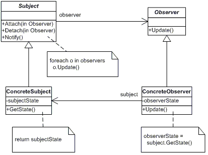
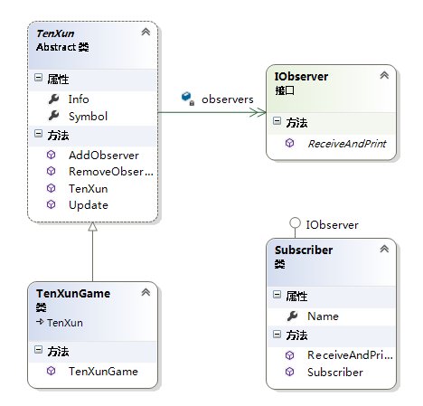

### 观察者模式

#### 一、观察者

　　从上面观察者模式的定义和生活中的例子，很容易知道，观察者模式中首先会存在两个对象，一个是观察者对象，另一个就是主题对象，然而，根据面向接口编程的原则，则自然就有抽象主题角色和抽象观察者角色。理清楚了观察者模式中涉及的角色后，接下来就要理清他们之间的关联了，要想主题对象状态发生改变时，能通知到所有观察者角色，则自然主题角色必须所有观察者的引用，这样才能在自己状态改变时，通知到所有观察者。有了上面的分析，下面观察者的结构图也就很容易理解了。具体结构图如下所示：



可以看出，在观察者模式的结构图有以下角色：

- 抽象主题角色（Subject）：抽象主题把所有观察者对象的引用保存在一个列表中，并提供增加和删除观察者对象的操作，抽象主题角色又叫做抽象被观察者角色，一般由抽象类或接口实现。
- 抽象观察者角色（Observer）：为所有具体观察者定义一个接口，在得到主题通知时更新自己，一般由抽象类或接口实现。
- 具体主题角色（ConcreteSubject）：实现抽象主题接口，具体主题角色又叫做具体被观察者角色。
- 具体观察者角色（ConcreteObserver）：实现抽象观察者角色所要求的接口，以便使自身状态与主题的状态相协调。

#### 二、代码

```c#
// 腾讯游戏订阅号类
    public class TenxunGame
    {
        // 订阅者对象
        public Subscriber Subscriber {get;set;} 

        public String Symbol {get; set;}

        public string Info {get ;set;}

        public void Update()
        {
            if (Subscriber != null)
            {
                // 调用订阅者对象来通知订阅者
                Subscriber.ReceiveAndPrintData(this);
            }
        }

    }

    // 订阅者类
    public class Subscriber
    {
        public string Name { get; set; }
        public Subscriber(string name)
        {
            this.Name = name;
        }

        public void ReceiveAndPrintData(TenxunGame txGame)
        {
            Console.WriteLine("Notified {0} of {1}'s" + " Info is: {2}", Name, txGame.Symbol, txGame.Info);
        }
    }

    // 客户端测试
    class Program
    {
        static void Main(string[] args)
        {
            // 实例化订阅者和订阅号对象
            Subscriber LearningHardSub = new Subscriber("LearningHard");
            TenxunGame txGame = new TenxunGame();

            txGame.Subscriber = LearningHardSub;
            txGame.Symbol = "TenXun Game";
            txGame.Info = "Have a new game published ....";

            txGame.Update();

            Console.ReadLine();
        }
    }
```

上面代码确实实现了监控订阅号的任务。但这里的实现存在下面几个问题：

- TenxunGame类和Subscriber类之间形成了一种双向依赖关系，即TenxunGame调用了Subscriber的ReceiveAndPrintData方法，而Subscriber调用了TenxunGame类的属性。这样的实现，如果有其中一个类变化将引起另一个类的改变。
- 当出现一个新的订阅者时，此时不得不修改TenxunGame代码，即添加另一个订阅者的引用和在Update方法中调用另一个订阅者的方法。

　　上面的设计违背了“开放——封闭”原则，显然，这不是我们想要的。**对此我们要做进一步的抽象，既然这里变化的部分是新订阅者的出现**，这样我们可以对订阅者抽象出一个接口，用它来取消TenxunGame类与具体的订阅者之间的依赖，做这样一步改进，确实可以解决TenxunGame类与具体订阅者之间的依赖，使其依赖与接口，从而形成弱引用关系，但还是不能解决出现一个订阅者不得不修改TenxunGame代码的问题。对此，我们可以做这样的思考——**订阅号存在多个订阅者，我们可以采用一个列表来保存所有的订阅者对象，在订阅号内部再添加对该列表的操作，这样不就解决了出现新订阅者的问题了嘛。并且订阅号也属于变化的部分，所以，我们可以采用相同的方式对订阅号进行抽象，抽象出一个抽象的订阅号类**，这样也就可以完美解决上面代码存在的问题了，具体的实现代码为：

```c#
// 订阅号抽象类
    public abstract class TenXun
    {
        // 保存订阅者列表
        private List<IObserver> observers = new List<IObserver>();

        public string Symbol { get; set; }
        public string Info { get; set; }
        public TenXun(string symbol, string info)
        {
            this.Symbol = symbol;
            this.Info = info;
        }

        #region 新增对订阅号列表的维护操作
        public void AddObserver(IObserver ob)
        {
            observers.Add(ob);
        }
        public void RemoveObserver(IObserver ob)
        {
            observers.Remove(ob);
        }
        #endregion

        public void Update()
        {
            // 遍历订阅者列表进行通知
            foreach (IObserver ob in observers)
            {
                if (ob != null)
                {
                    ob.ReceiveAndPrint(this);
                }
            }
        }
    }

    // 具体订阅号类
    public class TenXunGame : TenXun
    {
        public TenXunGame(string symbol, string info) 
            : base(symbol, info) 
        { 
        }
    }

    // 订阅者接口
    public interface IObserver 
    {
        void ReceiveAndPrint(TenXun tenxun);
    }

    // 具体的订阅者类
    public class Subscriber : IObserver
    {
        public string Name { get; set; }
        public Subscriber(string name)
        {
            this.Name = name;
        }

        public void ReceiveAndPrint(TenXun tenxun)
        {
            Console.WriteLine("Notified {0} of {1}'s" + " Info is: {2}", Name, tenxun.Symbol, tenxun.Info);
        }
    }

    // 客户端测试
    class Program
    {
        static void Main(string[] args)
        {
            TenXun tenXun = new TenXunGame("TenXun Game", "Have a new game published ....");

            // 添加订阅者
            tenXun.AddObserver(new Subscriber("Learning Hard"));
            tenXun.AddObserver(new Subscriber("Tom"));

            tenXun.Update();

            Console.ReadLine();
        }
    }
```

　　上面代码是我们进行重构后的实现，重构后的代码实现类图如下所示：



#### 三、.net中的实现

 在.NET中，我们可以使用委托与事件来简化观察者模式的实现，上面的例子用事件和委托的实现如下代码所示：  

```c#
namespace ObserverInNET
{
    class Program
    {
        // 委托充当订阅者接口类
        public delegate void NotifyEventHandler(object sender);

        // 抽象订阅号类
        public class TenXun
        {
            public NotifyEventHandler NotifyEvent;

            public string Symbol { get; set; }
            public string Info { get; set; }
            public TenXun(string symbol, string info)
            {
                this.Symbol = symbol;
                this.Info = info;
            }

            #region 新增对订阅号列表的维护操作
            public void AddObserver(NotifyEventHandler ob)
            {
                NotifyEvent += ob;
            }
            public void RemoveObserver(NotifyEventHandler ob)
            {
                NotifyEvent -= ob;
            }

            #endregion

            public void Update()
            {
                if (NotifyEvent != null)
                {
                    NotifyEvent(this);
                }
            }
        }

        // 具体订阅号类
        public class TenXunGame : TenXun
        {
            public TenXunGame(string symbol, string info)
                : base(symbol, info)
            {
            }
        }

        // 具体订阅者类
        public class Subscriber
        {
            public string Name { get; set; }
            public Subscriber(string name)
            {
                this.Name = name;
            }

            public void ReceiveAndPrint(Object obj)
            {
                TenXun tenxun = obj as TenXun;

                if (tenxun != null)
                {
                    Console.WriteLine("Notified {0} of {1}'s" + " Info is: {2}", Name, tenxun.Symbol, tenxun.Info);
                }            
            }
        }

        static void Main(string[] args)
        {
            TenXun tenXun = new TenXunGame("TenXun Game", "Have a new game published ....");
            Subscriber lh =  new Subscriber("Learning Hard");
            Subscriber tom =  new Subscriber("Tom");

            // 添加订阅者
            tenXun.AddObserver(new NotifyEventHandler(lh.ReceiveAndPrint));
            tenXun.AddObserver(new NotifyEventHandler(tom.ReceiveAndPrint));

            tenXun.Update();

            Console.WriteLine("-----------------------------------");
            Console.WriteLine("移除Tom订阅者");
            tenXun.RemoveObserver(new NotifyEventHandler(tom.ReceiveAndPrint));
            tenXun.Update();

            Console.ReadLine();
        }
    }
}
```


##### 四、观察者模式的适用场景

 　　在下面的情况下可以考虑使用观察者模式：

- 当一个抽象模型有两个方面，其中一个方面依赖于另一个方面，将这两者封装在独立的对象中以使它们可以各自独立地改变和复用的情况下。从方面的这个词中可以想到，观察者模式肯定在AOP（面向方面编程）中有所体现，更多内容参考：[Observern Pattern in AOP](http://www.cnblogs.com/idior/articles/229590.html).
- 当对一个对象的改变需要同时改变其他对象，而又不知道具体有多少对象有待改变的情况下。
- 当一个对象必须通知其他对象，而又不能假定其他对象是谁的情况下。

#### 五、观察者模式的优缺点

　　观察者模式有以下几个优点：

- 观察者模式实现了表示层和数据逻辑层的分离，并定义了稳定的更新消息传递机制，并抽象了更新接口，使得可以有各种各样不同的表示层，即观察者。
- 观察者模式在被观察者和观察者之间建立了一个抽象的耦合，被观察者并不知道任何一个具体的观察者，只是保存着抽象观察者的列表，每个具体观察者都符合一个抽象观察者的接口。
- 观察者模式支持广播通信。被观察者会向所有的注册过的观察者发出通知。

　　观察者也存在以下一些缺点：

- 如果一个被观察者有很多直接和间接的观察者时，将所有的观察者都通知到会花费很多时间。
- 虽然观察者模式可以随时使观察者知道所观察的对象发送了变化，但是观察者模式没有相应的机制使观察者知道所观察的对象是怎样发生变化的。
- 如果在被观察者之间有循环依赖的话，被观察者会触发它们之间进行循环调用，导致系统崩溃，在使用观察者模式应特别注意这点。