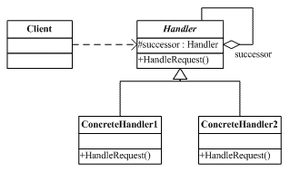

### 责任链

#### 一、定义

从生活中的例子可以发现，某个请求可能需要几个人的审批，即使技术经理审批完了，还需要上一级的审批。这样的例子，还有公司中的请假，少于3天的，直属Leader就可以批准，3天到7天之内就需要项目经理批准，多余7天的就需要技术总监的批准了。介绍了这么多生活中责任链模式的例子的，下面具体给出面向对象中责任链模式的定义。

　　责任链模式指的是——某个请求需要多个对象进行处理，从而避免请求的发送者和接收之间的耦合关系。将这些对象连成一条链子，并沿着这条链子传递该请求，直到有对象处理它为止。


#### 二、UML



主要涉及两个角色：

- 抽象处理者角色（Handler）：定义出一个处理请求的接口。这个接口通常由接口或抽象类来实现。
- 具体处理者角色（ConcreteHandler）：具体处理者接受到请求后，可以选择将该请求处理掉，或者将请求传给下一个处理者。因此，每个具体处理者需要保存下一个处理者的引用，以便把请求传递下去。


#### 三、代码

　　有了上面的介绍，下面以公司采购东西为例子来实现责任链模式。公司规定，采购架构总价在1万之内，经理级别的人批准即可，总价大于1万小于2万5的则还需要副总进行批准，总价大于2万5小于10万的需要还需要总经理批准，而大于总价大于10万的则需要组织一个会议进行讨论。对于这样一个需求，最直观的方法就是设计一个方法，参数是采购的总价，然后在这个方法内对价格进行调整判断，然后针对不同的条件交给不同级别的人去处理，这样确实可以解决问题，但这样一来，我们就需要多重if-else语句来进行判断，但当加入一个新的条件范围时，我们又不得不去修改原来设计的方法来再添加一个条件判断，这样的设计显然违背了“开-闭”原则。这时候，可以采用责任链模式来解决这样的问题。具体实现代码如下所示。

```c#
namespace ChainofResponsibility
{
    // 采购请求
    public class PurchaseRequest
    {
        // 金额
        public double Amount { get; set; }
        // 产品名字
        public string ProductName { get; set; }
        public PurchaseRequest(double amount, string productName)
        {
            Amount = amount;
            ProductName = productName;
        }
    }

    // 审批人,Handler
    public abstract class Approver
    {
        public Approver NextApprover { get; set; }
        public string Name { get; set; }
        public Approver(string name)
        {
            this.Name = name;
        }
        public abstract void ProcessRequest(PurchaseRequest request);
    }

    // ConcreteHandler
    public class Manager : Approver
    {
        public Manager(string name)
            : base(name)
        { }

        public override void ProcessRequest(PurchaseRequest request)
        {
            if (request.Amount < 10000.0)
            {
                Console.WriteLine("{0}-{1} approved the request of purshing {2}", this, Name, request.ProductName);
            }
            else if (NextApprover != null)
            {
                NextApprover.ProcessRequest(request);
            }
        }
    }

    // ConcreteHandler,副总
    public class VicePresident : Approver
    {
        public VicePresident(string name)
            : base(name)
        { 
        }
        public override void ProcessRequest(PurchaseRequest request)
        {
            if (request.Amount < 25000.0)
            {
                Console.WriteLine("{0}-{1} approved the request of purshing {2}", this, Name, request.ProductName);
            }
            else if (NextApprover != null)
            {
                NextApprover.ProcessRequest(request);
            }
        }
    }

    // ConcreteHandler，总经理
    public class President :Approver
    {
        public President(string name)
            : base(name)
        { }
        public override void ProcessRequest(PurchaseRequest request)
        {
            if (request.Amount < 100000.0)
            {
                Console.WriteLine("{0}-{1} approved the request of purshing {2}", this, Name, request.ProductName);
            }
            else
            {
                Console.WriteLine("Request需要组织一个会议讨论");
            }
        }
    }

    class Program
    {
        static void Main(string[] args)
        {
            PurchaseRequest requestTelphone = new PurchaseRequest(4000.0, "Telphone");
            PurchaseRequest requestSoftware = new PurchaseRequest(10000.0, "Visual Studio");
            PurchaseRequest requestComputers = new PurchaseRequest(40000.0, "Computers");

            Approver manager = new Manager("LearningHard");
            Approver Vp = new VicePresident("Tony");
            Approver Pre = new President("BossTom");

            // 设置责任链
            manager.NextApprover = Vp;
            Vp.NextApprover = Pre;

            // 处理请求
            manager.ProcessRequest(requestTelphone);
            manager.ProcessRequest(requestSoftware);
            manager.ProcessRequest(requestComputers);
            Console.ReadLine();
        }
    }
}
```


#### 四、责任链模式的适用场景 

　　在以下场景中可以考虑使用责任链模式：

- 一个系统的审批需要多个对象才能完成处理的情况下，例如请假系统等。
- 代码中存在多个if-else语句的情况下，此时可以考虑使用责任链模式来对代码进行重构。

#### 五、责任链模式的优缺点

　　责任链模式的优点不言而喻，主要有以下点：

- 降低了请求的发送者和接收者之间的耦合。
- 把多个条件判定分散到各个处理类中，使得代码更加清晰，责任更加明确。

　　责任链模式也具有一定的缺点，如：

- 在找到正确的处理对象之前，所有的条件判定都要执行一遍，当责任链过长时，可能会引起性能的问题
- 可能导致某个请求不被处理。

