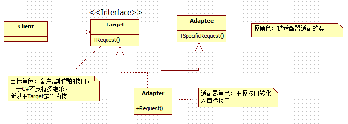
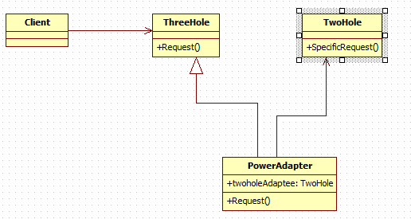

### 适配器

#### 一、定义

把一个类的接口变换成客户端所期待的另一种接口，从而使原本接口不匹配而无法一起工作的两个类能够在一起工作。适配器模式有类的适配器模式和对象的适配器模式两种形式，下面我们分别讨论这两种形式的实现和给出对应的类图来帮助大家理清类之间的关系


#### 二、代码

```c#
using System;

/// 这里以插座和插头的例子来诠释适配器模式
/// 现在我们买的电器插头是2个孔，但是我们买的插座只有3个孔的
/// 这是我们想把电器插在插座上的话就需要一个电适配器
namespace 设计模式之适配器模式
{
    /// <summary>
    /// 客户端，客户想要把2个孔的插头 转变成三个孔的插头，这个转变交给适配器就好
    /// 既然适配器需要完成这个功能，所以它必须同时具体2个孔插头和三个孔插头的特征
    /// </summary>
    class Client
    {
        static void Main(string[] args)
        {
            // 现在客户端可以通过电适配要使用2个孔的插头了
            IThreeHole threehole = new PowerAdapter();
            threehole.Request();
            Console.ReadLine();
        }
    }

    /// <summary>
    /// 三个孔的插头，也就是适配器模式中的目标角色
    /// </summary>
    public interface IThreeHole
    {
        void Request();
    }

    /// <summary>
    /// 两个孔的插头，源角色——需要适配的类
    /// </summary>
    public abstract class TwoHole
    {
        public void SpecificRequest()
        {
            Console.WriteLine("我是两个孔的插头");
        }
    }

    /// <summary>
    /// 适配器类，接口要放在类的后面
    /// 适配器类提供了三个孔插头的行为，但其本质是调用两个孔插头的方法
    /// </summary>
    public class PowerAdapter:TwoHole,IThreeHole
    {
        /// <summary>
        /// 实现三个孔插头接口方法
        /// </summary>
        public void Request()
        {
            // 调用两个孔插头方法
            this.SpecificRequest();
        }
    }
}
```


#### 三、UML




上面都是类的适配器模式的介绍，然而适配器模式还有另外一种形式——对象的适配器模式，这里就具体讲解下它的实现，实现的分析思路：**既然现在适配器类不能继承TwoHole抽象类了（因为用继承就属于类的适配器了），但是适配器类无论如何都要实现客户端期待的方法的，即Request方法，所以一定是要继承ThreeHole抽象类或IThreeHole接口的，然而适配器类的Request方法又必须调用TwoHole的SpecificRequest方法，又不能用继承，这时候就想，不能继承，但是我们可以在适配器类中创建TwoHole对象，然后在Requst中使用TwoHole的方法了。正如我们分析的那样，对象的适配器模式的实现正式如此**。下面就让我看看具体实现代码：

```
namespace 对象的适配器模式
{
    class Client
    {
        static void Main(string[] args)
        {
            // 现在客户端可以通过电适配要使用2个孔的插头了
            ThreeHole threehole = new PowerAdapter();
            threehole.Request();
            Console.ReadLine();
        }
    }

    /// <summary>
    /// 三个孔的插头，也就是适配器模式中的目标(Target)角色
    /// </summary>
    public class ThreeHole
    {
        // 客户端需要的方法
        public virtual void Request()
        {
            // 可以把一般实现放在这里
        }
    }

    /// <summary>
    /// 两个孔的插头，源角色——需要适配的类
    /// </summary>
    public class TwoHole
    {
        public void SpecificRequest()
        {
            Console.WriteLine("我是两个孔的插头");
        }
    }

    /// <summary>
    /// 适配器类，这里适配器类没有TwoHole类，
    /// 而是引用了TwoHole对象，所以是对象的适配器模式的实现
    /// </summary>
    public class PowerAdapter : ThreeHole
    {
        // 引用两个孔插头的实例,从而将客户端与TwoHole联系起来
        public TwoHole twoholeAdaptee = new TwoHole();

        /// <summary>
        /// 实现三个孔插头接口方法
        /// </summary>
        public override void Request()
        {
            twoholeAdaptee.SpecificRequest();
        }
    }
}
```


从上面代码可以看出,对象的适配器模式正如我们开始分析的思路去实现的, 其中客户端调用代码和类的适配器实现基本相同,下面让我们看看对象的适配器模式的类图,具体类图如下:




#### 三、优缺点

**类的适配器模式：**

**优点：**

- 可以在不修改原有代码的基础上来复用现有类，很好地符合 “开闭原则”
- 可以重新定义Adaptee(被适配的类)的部分行为，因为在类适配器模式中，Adapter是Adaptee的子类
- 仅仅引入一个对象，并不需要额外的字段来引用Adaptee实例（这个即是优点也是缺点）。

**缺点：**

- 用一个具体的Adapter类对Adaptee和Target进行匹配，当如果想要匹配一个类以及所有它的子类时，类的适配器模式就不能胜任了。因为类的适配器模式中没有引入Adaptee的实例，光调用this.SpecificRequest方法并不能去调用它对应子类的SpecificRequest方法。
- 采用了 “多继承”的实现方式，带来了不良的高耦合。

**对象的适配器模式**

**优点：**

- 可以在不修改原有代码的基础上来复用现有类，很好地符合 “开闭原则”（这点是两种实现方式都具有的）
- 采用 “对象组合”的方式，更符合松耦合。

缺点：

- 使得重定义Adaptee的行为较困难，这就需要生成Adaptee的子类并且使得Adapter引用这个子类而不是引用Adaptee本身。


#### 四、使用场景

在以下情况下可以考虑使用适配器模式：

1. 系统需要复用现有类，而该类的接口不符合系统的需求
2. 想要建立一个可重复使用的类，用于与一些彼此之间没有太大关联的一些类，包括一些可能在将来引进的类一起工作。
3. 对于对象适配器模式，在设计里需要改变多个已有子类的接口，如果使用类的适配器模式，就要针对每一个子类做一个适配器，而这不太实际